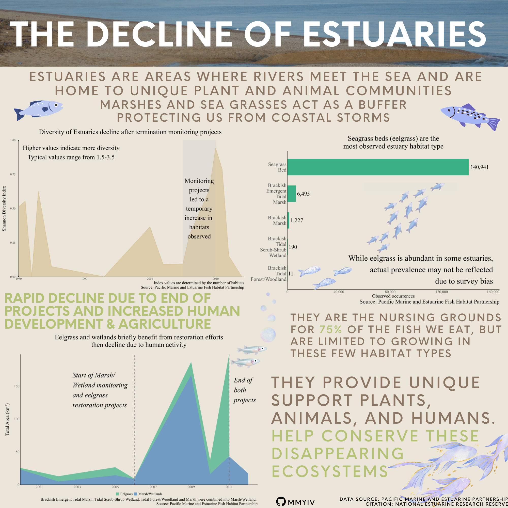

## What is an estuary? Why are they relevant?

According to the National Estuarine Research Reserve System, estuaries are "bodies of water usually found where rivers meet the sea". As a result of this unique mixing, many plant and animal communities have adapted to this brackish water and influx of nutrients, sediment, and other debris. These communities tend to be very productive and capable of adapting to a variety of conditions, but are still susceptible to substantial changes in nutrient and sediment.

Beyond providing essential habitats for these plants and animals, estuaries provide many benefits for humans as well. Estuaries provide ecosystem services, which is defined by the NOAA office of National Marine Sanctuaries as "the benefits people obtain from nature through use, consumption, enjoyment, and/or simply knowing these resources exist (non-use)". For example, they provide economic benefits such as tourism, transportation, and food sources. Estuaries also play a vital role in protecting areas from excess flood and storm water and filtering water.

## Background

Data from the [Pacific Marine and Estuarine Fish Habitat Partnership](https://www.pacificfishhabitat.org/data/estuarine-biotic-habitat) contains information about the biotic components of estuaries, or the living species (both plant and animal) that make up a habitat type.

I aim to create an infographic displaying how estuaries have declined overtime (1988-2011), focusing specifically on changes in biodiversity, area coverage by habitat, and the types of habitats observed. This infographic will use area charts and a bar chart to show key trends and end with a call to action for conservation of estuaries.

## Infographic

{fig-alt="Infographic about how estuaries have declined from 1988 to 2011. There are three main plots: A line plot showing fluctuations in diversity due to temporary monitoring projects, a bar plot showing how eelgrass is the most common habitat, and a stacked area chart displaying different peaks in total area between eelgrass and wetlands. Wetland area peaks in 2009 due to monitoring efforts, not necessarily reflecting actual increases in area. Eelgrass area peaks in 2011 from restoration projects. Estuaries are vital to plants, animals and humans as they provide many vital services needed to thrive."}

## Creating the visualization

This infographic was compiled using Canva and the visualizations were created using R.

### Load libraries

```{r}
#| code-fold: true
#| code-summary: "Show the code"

library(tidyverse)
library(here)
library(janitor)
library(dplyr)

library(sf)
library(scales)
library(ggbump)
library(stringr)
library(vegan)
library(ggridges)
```

### Read in and clean data

```{r echo = T, results = 'hide'}
#| code-fold: true
#| code-summary: "Show the code"

# Path to the geodatabase folder
gdb_path <- here('blogpost/estuary/data/PMEP_estuary.gdb')

# List all layers (tables and feature classes) in the geodatabase
layers <- st_layers(gdb_path)

# Read in data 
estuary <- st_read(gdb_path,layer = "PMEP_West_Coast_USA_Estuarine_Biotic_Habitat_Vers1_2"
) %>%
 clean_names()

# Clean data -----------------------------------------------------------------------------------------------------------

# Clean the data set
estuary <- estuary %>%
# Drop extra columns
  select(-c('data_source', 'cmecs_bc_code', 'cmecs_link', 
            'data_source_vers', 'pmep_estuary_id', 'link', 
            'cmecs_id', 'acres', 'pmep_poly_id')) %>%
# Rename columns to be more intuitive
  rename(
    name = estuary_name,
    biotic_comp = cmecs_bc_name,
    level = cmecs_level,
    setting = cmecs_bc_setting,
    class = cmecs_bc_class,
    subclass = cmecs_bc_subclass,
    group = cmecs_bc_group,
    community = cmecs_bc_community,
    modifier = cmecs_bc_modifier,
    area_hectares = hectares, # Will convert to km2
    year_data = data_year,
    year_nwi = nwi_year,
    habitat_percent = habitat_source_percent,
    length_shape = shape_length,
    area_shape = shape_area,
    shape = Shape
  ) %>%
  
  # Convert area to km2
    mutate(area_km2 = area_hectares * 0.01) %>%  
    select(-area_hectares) %>%
  
  # Convert N/A values to true NAs
    mutate(across(where(is.character), ~ na_if(., "N/A"))) %>%
  
  # Handle missing values
  mutate(group = na_if(group, ""), # Replace empty strings in 'group' with NA
         year_nwi = as.numeric(year_nwi)) %>%
  
  filter(!is.na(group) & !is.na(year_nwi))
```

## Visualization 1: How has biodiversity changed over time?

I used an area plot to show how biodiversity fluctuated, mainly due to monitoring projects. Biodiversity is calculated using the Shannon Index, where a greater number of habitats observed will lead to a higher index value, indicating more biodiversity. Here, we see that "good" biodiversity values fall from 1.5-3.5 for the Shannon index.

The United States Environmental Protection Agency started a wetland development program in 2007 to provide plans that state goals and actions to achieve those goals within a specified time period. The peak in 2010 is likely a result of the implementation and completion of these plans, which explains the sharp decrease following this year.

{fig-alt="Area chart showing fluctuations in biodiversity in estuaries using the Shannon Biodiversity index. There is a notable peak from 2007-2010, likely due to a temporary monitoring project."}

```{r}
#| code-fold: true
#| code-summary: "Show the code"
#| fig-alt: "Area chart showing fluctuations in biodiversity in estuaries using the Shannon Biodiversity index. There is a notable peak from 2007-2010, likely due to a temporary monitoring project."

# Calculate Shannon diversity index for each year
biotic_diversity <- estuary %>%
  st_drop_geometry() %>%
  group_by(year_nwi) %>%
  summarize(shannon_index = diversity(table(biotic_comp), index = "shannon"))

# -------------------------------------------------------------------------------


# Plot Shannon Diversity Over Time using an area chart

p1 <- ggplot(biotic_diversity, aes(x = year_nwi, y = shannon_index)) +
  geom_line(linewidth = 1, color = "#D8C397") +
  
  # Turn into area chart
  geom_area(fill = "#D8C397", alpha = 0.7) +
  
# ---------Annotation #1: Describing the y axis--------- 
  
  # Add double-sided arrow on y-axis
  geom_segment(aes(x = 1980, xend = 1980, 
                   y = 0, yend = 1), 
               arrow = arrow(type = "closed", 
                             length = unit(0.2, "cm")), 
               color = "black") + 

  geom_segment(aes(x = 1980, xend = 1980, 
                   y = 1, yend = 0), 
               arrow = arrow(type = "closed", 
                             length = unit(0.2, "cm")), 
               color = "black") +
  
   # Annotation along y axis to describe values
  annotate("text", x = 1980 + 8, 
           y = 1 - 0.09,  
           label = "Higher values indicate more diversity\nTypical values range from 1.5-3.5", 
            hjust = 0.5, size = 12, family = "serif") +

# ---------Annotation #2: Describing the peak--------- 
  
  # Highlight 2007-2010 with a transparent rectangle
  annotate("rect", xmin = 2005, xmax = 2010, 
                   ymin = -Inf, ymax = Inf,
           fill = "gray", alpha = 0.2) +
  
  # Annotation for the highlighted area
  annotate("text", x = 2007.5, y = 0.5,
           label = "Monitoring\nprojects\nled to a\ntemporary\nincrease in \nhabitats\nobserved", size = 12, family = "serif", color = 'black') +
  
# --------- End Annotation #2------------------------ 
  
  # Labels
  labs(title = "Diversity of Estuaries decline after termination monitoring projects",
       x = NULL, 
       y = "Shannon Diversity Index",
       caption = "Index values are determined by the number of habitats\nSource: Pacific Marine and Estuarine Fish Habitat Partnership") +
  
  # Fit to edges
  scale_x_continuous(expand = c(0.009, 0.0)) + # Keep arrowhead from being cut off
  scale_y_continuous(expand = c(0,0)) +
  
  # Theme adjustments
  theme_minimal() +
  theme(
        # Increase general text size
        text = element_text(family = "serif"),
        
        # Increase plot title size and margin
        plot.title = element_text(size = 36, hjust = 0.5, margin = margin(b = 25)),
        
        # Adjust caption size
        plot.caption = element_text(size = 30),
        
        # Remove grid and axis lines
        panel.grid = element_blank(),
        axis.line.y = element_blank(),
        
        # Add back x-axis line
        axis.line = element_line(color = "black", linewidth = 0.5),
        
        # Increase axis text size
        axis.text = element_text(size = 16),
        
        # Edit y-axis margins and size
        axis.title.y = element_text(size = 30, margin = margin(r = 20)),
        
        # Edit plot margins
        plot.margin = margin(t = 0.5, r = 0, b = , l = 0.5, unit = "cm")) 
```

## Visualization 2: How has area changed over time?

Here, I used a stacked area chart to show changes in area between eelgrass and combined wetland types. I combined all the wetland types as there were very few data points for each subtype, and was not visible on the plot.

While the wetland development program did lead to a temporary increase in biodiversiy and area, its completion made way for human development and agriculture in these areas, leading to less area available for the native flora and fauna. Also note that wetland area sharply decreases in 2010 whereas eelgrass reaches its peak. Eelgrass restoration projects could occur separately from wetland projects, which explains this disparity.

{fig-alt="Stacked Area chart showing how eelgrass and wetland/marsh areas have changed over time. There are two noticible peaks, one in 2008 for both eelgrass and wetlands, likely the result of the monitoring projects. However, in 2010 eelgrass peaks while estuaries reach a low, showing the termination of the wetland program prior to the eelgrass restoration projects."}

```{r}
#| code-fold: true
#| code-summary: "Show the code"
#| fig-alt: "Stacked Area chart showing how eelgrass and wetland/marsh areas have changed over time. There are two noticible peaks, one in 2008 for both eelgrass and wetlands, likely the result of the monitoring projects. However, in 2010 eelgrass peaks while estuaries reach a low, showing the termination of the wetland program prior to the eelgrass restoration projects."

# Data wrangling

# Summarize area_km2 by biotic component and year
estuary_summary <- estuary %>%
  st_drop_geometry() %>%
  filter(year_nwi >= 1995 & year_nwi <= 2017) %>%
  group_by(group, year_nwi) %>%
  summarise(total_area = sum(area_km2, na.rm = TRUE), .groups = 'drop')


# Create a new column to group categories (simplify)
estuary_filtered <- estuary_summary %>%
  mutate(biotic_group = case_when(
    group %in% c("Brackish Emergent Tidal Marsh", 
                       "Brackish Tidal Scrub-Shrub Wetland", 
                       "Brackish Tidal Forest/Woodland", 
                       "Brackish Marsh") ~ "Marsh/Wetlands",
    group %in% c("Eelgrass", "Seagrass Bed") ~ "Eelgrass",
    TRUE ~ group  # Keep other categories unchanged
  )) %>%
  group_by(year_nwi, biotic_group) %>%
  summarise(total_area = sum(total_area, na.rm = TRUE)) %>%
  ungroup()

# Make a new df
estuary_bump <- as.data.frame(estuary_filtered) %>%
  filter(year_nwi >= 1995 & year_nwi <= 2013) %>%
  select(biotic_group, year_nwi, total_area)

# END data wrangling ----------------------------------------------------------------------------------------

# Visualization # 2: Area over time

# Wrapped caption text
wrapped_caption <- str_wrap("Brackish Emergent Tidal Marsh, Tidal Scrub-Shrub Wetland, Tidal Forest/Woodland and Marsh were combined into Marsh/Wetland.", width = 50000)


# Create stacked area chart
p2 <- ggplot(estuary_bump, aes(x = year_nwi, 
                         y = total_area, 
                         fill = biotic_group)) +
  geom_area(alpha = 0.7, size = 1) +

  
  # Set axis scale
  scale_x_continuous(breaks = seq(1995, 2012.5, by = 2), 
                     limits = c(2000, 2012.5),
                     expand = c(0, 0)) +  
  scale_y_continuous(expand = c(0,0)) +
  
  
# Annotation for wetland-------------------------------
  
  # Set vline
  geom_vline(data = estuary_bump,
           aes(xintercept = 2006),
           linetype = "dashed", color = "black", size = 1) +
  
  # Add annotation
  geom_text(data = estuary_bump, 
            aes(x = 2002.75,  
                y = 180 * 0.8,
                label = "Start of Marsh/ \nWetland monitoring\nand eelgrass\nrestoration projects"),
            color = "black", size = 12, hjust = 0, family = "serif", fontface = 'italic') +
  
# Annotation for end of both ---------------------------
  
  # Add vline
  geom_vline(data = estuary_bump,
           aes(xintercept = 2011),
           linetype = "dashed", color = "black", size = 1.2) +
  
  geom_text(data = estuary_bump, 
            aes(x = 2011.25,  
                y = 180 * 0.8,
                label = "End of\nboth\nprojects"),
            color = "black", size = 12, hjust = 0, family = "serif", fontface = 'italic') +
  
# ------------------------------------------------------  

  # Labels
  labs(title = "Eelgrass and wetlands briefly benefit from restoration efforts\nthen decline due to human activity",
       x = NULL,
       y = "Total Area (km²)",
       caption = paste(wrapped_caption,"\nSource: Pacific Marine and Estuarine Fish Habitat Partnership"),
       fill = NULL) +
  
  # Edit theme
  theme_minimal() +
  
  theme(
        
        # Adjust legend position
        legend.position = 'bottom',
        
        # Change all text size to 18
        text = element_text(family = "serif", size = 18),
        
        # Change title size and margin
        plot.title = element_text(size = 34, hjust = 0.5, 
                                  margin = margin(b = 30)),
        
        # Change caption size
        plot.caption = element_text(size = 26),
        
        # Remove gridlines
        panel.grid = element_blank(),
        
        # Add x and y axis lines
        axis.line = element_line(color = "black", linewidth = 0.5),
        
        # Change axes text size and margins
        axis.text.x = element_text(size = 20),  
        axis.text.y = element_text(size = 20),
        axis.title.y = element_text(size = 230, margin = margin(r = 20)),
        
        # Change legend text size
        legend.text = element_text(size = 24),
        
        # Change plot margins
        plot.margin = margin(r = 45, t = 10, b = 10, l = 10)) +

  # Set custom colors
  scale_fill_manual(values = c('#3BAF85', '#3C7BB7'))
```

## Visualization 3: Do estuaries represent an equal proportion of habitat types?

I wanted to look at what habitats were observed in estuaries, where this chart shows that eelgrass beds are far more prominent than marshes and wetlands.
However, this may be the result of surveying bias. PMEP has a separate dedicated data set specifically for eelgrass, and this data also contains a separate year column for eelgrass observations. While eelgrass is prominent in some estuaries, this disparity may not accurately reflect its true prevalence. 

{fig-alt="Bar chart showing 5 broad habitat types within estuaries. Eelgrass vastly outnumbers the observed occurences of other habitats, although this may be due in part to survey bias."}

```{r}
#| code-fold: true
#| code-summary: "Show the code"
#| fig-alt: "Bar chart showing 5 broad habitat types within estuaries. Eelgrass vastly outnumbers the observed occurences of other habitats, although this may be due in part to survey bias."

# Wrap labels using sapply
wrapped_labels <- function(labels) {
  sapply(labels, function(x) str_wrap(x, width = 3))
}

# Find counts first to decrease plotting time
estuary_summary <- estuary %>%
  st_drop_geometry() %>%
  count(group, name = "count") %>%  # Count occurrences of each group
  mutate(group = fct_reorder(group, count, .desc = FALSE))  # Reorder by count

# Plot the data using a bar chart

p3 <- ggplot(data = estuary_summary, aes(x = group, y = count)) +
  
  geom_col(fill = "#3BAF85", color = "#3BAF85", 
           size = 1, width = 0.6) +
    
  # Flip axis and expand  
  scale_y_continuous(expand = c(0, NA), 
                     limits = c(0, 165000), 
                     labels = scales::comma) + # Make room for eelgrass 
  coord_flip() +
    
    
  # Apply wrapped labels
  scale_x_discrete(labels = wrapped_labels) +
  
  # Label plot  
  labs(title = "Seagrass beds (eelgrass) are the\nmost observed estuary habitat type", 
       x = NULL, 
       y = "Observed occurrences",
       caption = "Source: Pacific Marine and Estuarine Fish Habitat Partnership",
       ) +
    
  # Add text labels  
  geom_text( 
            aes(label = scales::comma(count)), na.rm = TRUE,  
            hjust = -0.1, 
            vjust = 0.5,
            size = 10,
            family = 'serif') +
  
  # Add annotation addressing scale
  
   annotate("text", x = 1.15, y = 160000,
           label = "While eelgrass is abundant in some estuaries,\nactual prevalence may not be reflected\ndue to survey bias", 
           size = 14, family = "serif", color = 'black', hjust = 1) +
  
  
  # Adjust theme  
  theme_minimal() + 

  
  theme(
        # Remove legend
        legend.position = "none", 
        
        # Apply serif
        text = element_text(family = "serif", size = 24),
        
        # Adjust title size and margin
        plot.title = element_text(size = 36, hjust = 0.5),
        
        # Adjust caption size
        plot.caption = element_text(size = 28),
        
        # Remove grid and add axis lines
        panel.grid = element_blank(),
        axis.line = element_line(color = "black", size = 0.5),
        
        # Change axis text size and margins
        axis.text.y = element_text(size = 26),
        axis.title.y = element_text(size = 22, margin = margin(r = 20)),
        
        # Change plot margins
        plot.margin = margin(r = 45, t = 10, b = 10, l = 10))
```

## Important design elements

I had envisioned this infographic to be displayed in an aquarium or in an education setting for a younger audience.

I started with a eye-grabbing, decisive title to hook the viewer's attention. I decided to use more simple charts that most would be able to understand in shorts amount of time. 

I made sure to include a definition and why they were relevant to human use right below the title. Then, I used "serif" family text on the plots to provide the plots with more of an official, research feel to make the reader trust the information displayed. Outside of the plots, I used all caps to again draw the viewer's attention about the main takeaways and context for estuaries. I highlighted key facts with a different color to emphasize the important parts of the text. Finally, I included a call to action in the lower corner, making sure to contrast with the rest of the text by increasing its size. 

The color theme I chose was to be representative of an estuary, blue for water and green for the plants, with plenty of fish icons throughout the infographic. For the bar plot, I included fish moving to seagrass beds to reinforce how it outnumbers the other habitats.

Alt text is included for individual plots and for the entire infographic, and green, red, and blue color blindness checks were conducted using the "Let's get color blind" extension for google chrome.

Ultimately, this infographic purpose is to to emphasize the steep decline in area and biodiversity following the end of monitoring and restoration projects in 2010. While seagrass appears to be thriving, more monitoring is needed to see its actual status and to understand what fish populations depend on it. Marshes and wetlands are in critical condition by comparison, which pose a huge threat for the fish livelihood. Finally, the data used is representative of all estuaries along the West Coast United states, as a group effort is needed to continue conservation efforts. 


## Citations

National Estuarine Research Reserve System. (n.d.). What is an estuary? NOAA Office for Coastal Management. Retrieved from https://coast.noaa.gov/nerrs/about/what-is-an-estuary.html

Pacific Marine and Estuarine Fish Habitat Partnership (PMEP). (2017). West Coast USA Estuarine Biotic Habitat. Retrieved February 20, 2024. https://www.pacificfishhabitat.org/data/estuarine-biotic-habitat
