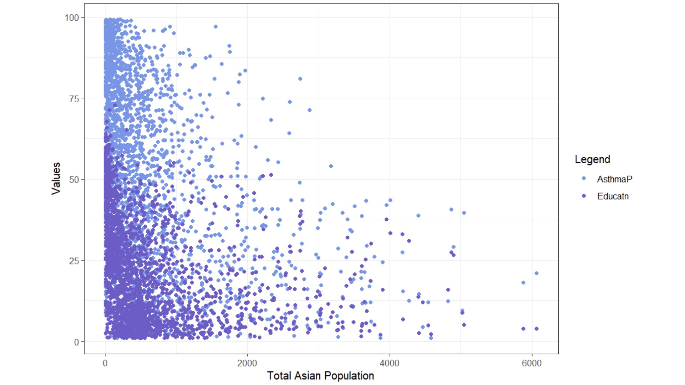
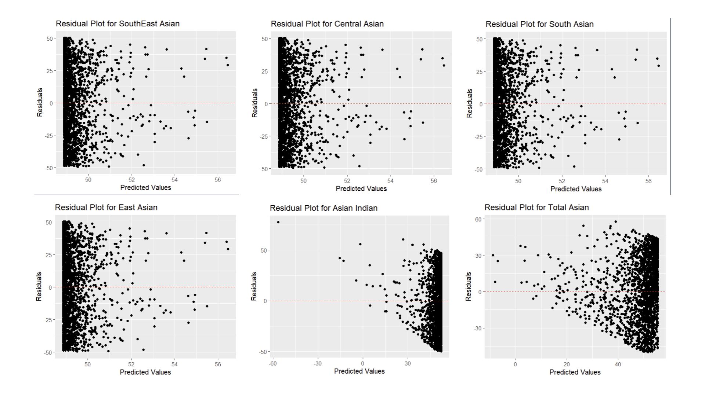
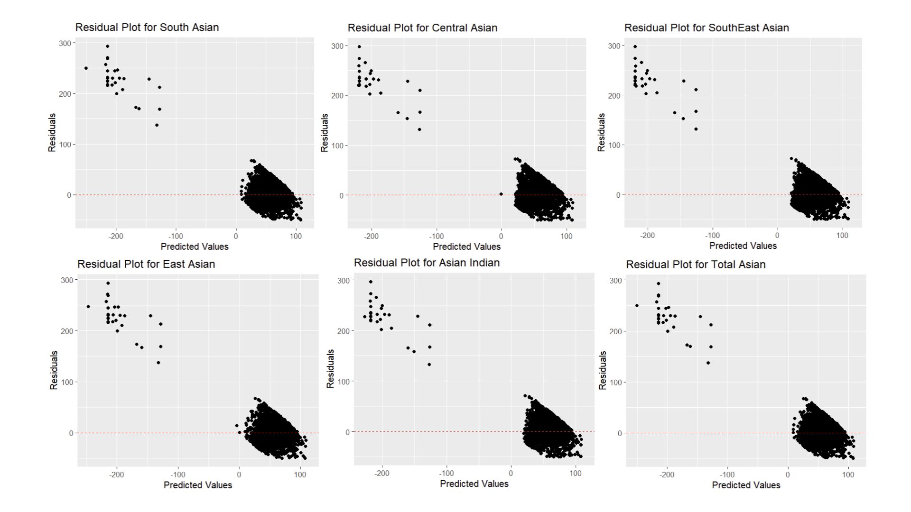
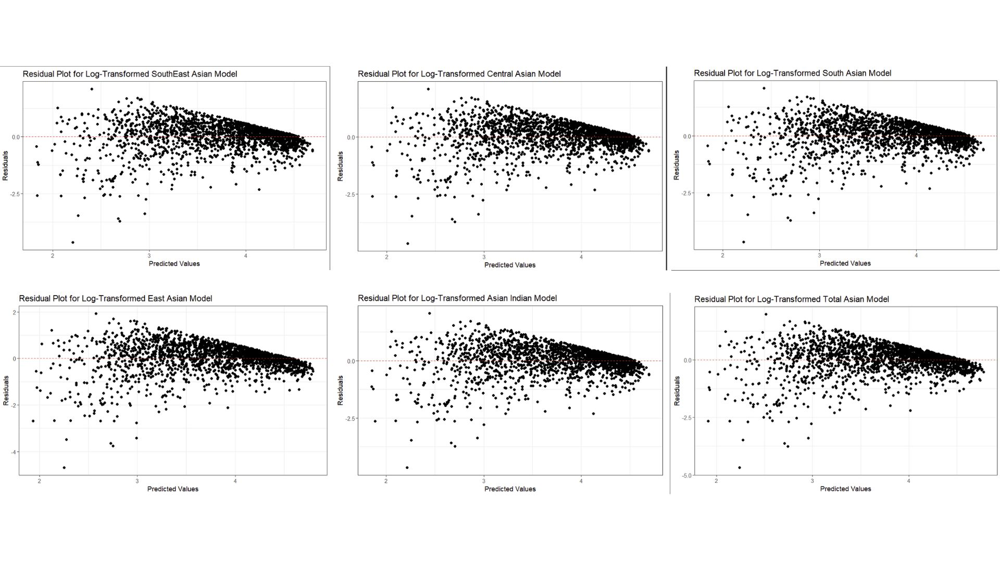

## Why are we exploring relationships between Asian ethnic groups and asthma rates?

Although some environmental regulations have succeeded in decreasing concentration of air pollutants – especially those linked with respiratory issues, as of 2016 approximately 1,221,000 people in LA county have been diagnosed with asthma. Factors such as proximity to highways and concentrations of pollutants linked to asthma (NO2 and PM2.5) vary across the entirety of LA county. 

Various articles have cited studies showing that minorities typically have higher rates of asthma, as seen by Simon et al (2003) and Meng et al (2007). However, both articles emphasize how African Americans have the highest rates of asthma, while Asians tend to be on the lower side of the spectrum.
Thus, I wanted to explore how Asian communities are impacted by asthma. Although they are not as impacted, I know of many members in this community inside LA county that have asthma. 

I am looking at the relationship between Asian ethnic groups and asthma rates, defined as the percentage of asthma-related emergency department visits. However, I also want to account for more variables as there are various socioeconomic and environmental factors at play. Based on the study by Simon et al (2003), where Asthma rates had an inverse relationship to income, I explored how low income census tracts affect the relationship with asthma. Finally, I also wanted to explore how education level will affect the relationship because it can affect how informed decisions can be about health. 

## Data

#### Census Data

Asian ethnic groups were sourced from the US Census Bureau using the tidycensus package. Population estimates were obtained from 2019 from the 5 year American Community Survey (2016-2020). 24 different asian populations were used: Total Asian, Asian Indian, Bangladeshi, Bhutanese, Burmese, Cambodian, Chinese (except Taiwanese), Filipino, Hmong, Indonesian, Japanese, Korean, Laotian, Malaysian, Mongolian, Nepalese, Okinawan, Pakistani, Sri Lankan, Taiwanese, Thai, Vietnamese, Other Asian (specified), and Other Asian (not specified).

Other asian specified and not specified were not included in this analysis to make categorizing easier.

These populations were grouped into 5 different Asian ethnic groups by the following:

- East Asian: Chinese (except Taiwanese), Japanese, Korean, Taiwanese, Mongolian, Okinawan.
- Central Asian: Bhutanese.
- South Asian: Bangladeshi, Nepali, Pakistani, Sri Lankan.
- Asian Indian: Asian Indian.
- Southeast Asian: Filipino, Vietnamese, Cambodian, Laotian, Burmese, Thai, Indonesian, Malaysian, Hmong.

#### CalEnviroScreen 4.0
Asthma estimates and Education percentages were sourced from CalEnviroScreen 4.0
The Asthma variable in this analysis is defined as the age-adjusted rate of emergency department visits for asthma, while the education variable is defined as the percent of population over 25 with less than a high school education.

#### EJScreen
Finally, the Low Income variable was sourced from EJScreen, and is defined as the percentage of households whose income is less than or equal to twice the poverty level.

All data were combined into one data set by census tract.

## How will we analyze this data?

To start this analysis, I first wanted to view the relationship between Asthma and our different Asian ethnic groups. I started with a linear model, with Asthma being a function of each Asian ethnic group.
Although I expect for the correlations and r-squared to be very low, I still wanted to see how this data would look against our regression line and what our residual plots (residuals plotted against predicted values) would look like. 

Then, I will add our other variables: Education and Low income. I expect for the r-squared value to increase because there are many factors that play into Asthma rates. There are a variety of socioeconomic factors such as access to health care and having the ability to accord medical expenses, in addition to environmental factors such as proximity to highways and NO2 concentration that contribute to both asthma rates and the percentage of people that actually visit the emergency department.

I chose to focus on education and low income because that tends to dictate whether someone will visit the emergency department in my personal experiences. For example, if someone is unaware of warning signs of a severe asthma attack or if they are unwilling to pay the fees, choosing to “tough it out” at home, they typically will not visit the emergency department.

## Results

#### Initial lm (Asthma ~ Asian Ethnic Group)

This figure depicts a scatter plot the relationship between the percentage of asthma related emergency department visits, the percentage of households with less than a high school education, and the total asian population. Here, we have most of our variables of interest. Low income was excluded from this plot due to its only two data points being covered. Additionally, only total Asian population was mapped here to gain a general idea of the relationship. However, it is hard to understand what this plot is trying to show, so I will now explore the relationship between Asthma and Asian ethnic groups through a linear model.

Clearly, this model is not a good fit for this relationship. However, we did expect this and hope to see better results when we add our additional variables. I would also like to note how the Residual plot for Asian Indians is completely different compared to the other plots. What this suggests is that Asian Indians may be over-represented for Asthma related emergency department visits. This data also plays a large impact on the total population, as seen in the plot.

#### Adding Education and Low Income to our Model

Here, our results are still not clear. Now all Asian Ethnic Groups' plot follow a similar pattern of a large group of residuals between 0 and 100, and a small group of residuals with negative predicted values. This could indicate that this model is under predicting Asthma for some Asian Ethnic groups.

#### Using Log

Here, I decided to take the log of both the response and the predictor because there were large amounts of variation in both. I took the log as a way to address the non-linearity in this spatial glm. 
However, non-linearity is still present as residuals are not scattered around zero as seen by this wedge-like shape. Furthermore, the variance of these residuals are not constant, which is a direct violation of one of the OLS assumptions, Finally, these plots are quite similar to each other, which indicates co linearity or correlations between variables.

The residual plot does not show whether different Asian people are more likely to have asthma. 

A formal interpretation is that every 1% increase in the total Asian population is associated with a 0.04% decrease in asthma prevalence. Essentially, 
areas with a higher proportion of Asian populations might have slightly lower asthma ED visits,  but the effect is very small.

## Future Analysis

Per Max’s suggestion, fitting this relationship into a generalized linear model (glm) with beta distribution, as this is used for data that falls between 0 and 1 (thus, these percentages).
While all my additional variables are already in percentage form, the Asian ethnic groups are by count, not percentage. Therefore, I would need to convert them into percentages to keep all units consistent and usable for this new glm.

Furthermore, it would be interesting to calculate percentages by census tract. I had only used census tracts to join the datasets together, and did not explore differences between them. Therefore, it would be interesting to see how the relationship is visualized, then further analysis could be done in areas with high prevalence. It would also be interesting to see what socioeconomic factors would contribute most to asthma rates between areas of low and high particulate matter 2.5 and/or position from the nearest highway, using a parallel slopes model. 4

I would also look into other factors that would contribute to this relationship (OVB). Education played a much larger role compared to Low income, and exploring if those could be an interaction term would be interesting. I think an interaction term would be more likely because education level and income level are likely to be linked. If a family has the necessary resources, they are more likely to have the privilege of attending school instead of having to prioritize making a living.

Although my analysis showed an (albeit small but) negative relationship between Asthma related emergency department visits, Asian ethnic groups, education level and low income, it was interesting the weight of each variable’s effect. I thought that Low income would  be the driving force in this model, however Education was what impacted the r-squared value the most. While this could be due to the lack of data from EJScreen’s low income variable, I think that there is a reason for this that I would have liked to explore more.  

## References

### Studies

Simon PA, Zeng Z, Wold CM, Haddock W, Fielding JE. Prevalence of childhood asthma and associated morbidity in Los Angeles County: impacts of race/ethnicity and income. J Asthma. 2003;40(5):535-43. doi: 10.1081/jas-120018788. PMID: 14529103.

Meng YY, Babey SH, Hastert TA, Brown ER. California's racial and ethnic minorities more adversely affected by asthma. Policy Brief UCLA Cent Health Policy Res. 2007 Feb;(PB2007-3):1-7. PMID: 17338094.

### Datasets used

Office of Environmental Health Hazard Assessment (OEHHA). (n.d.). CalEnviroScreen 4.0 report. Retrieved December 10, 2024, from https://oehha.ca.gov/calenviroscreen/report/calenviroscreen-40

U.S. Environmental Protection Agency (EPA). (n.d.). Geodatabase of state EJScreen data at the tract level. Retrieved December 10, 2024, from https://www.epa.gov/ejscreen/download-ejscreen-data

U.S. Census Bureau. (2019). 2019 American Community Survey 5-Year Estimates, Table B02018: Asian Alone or In Any Combination by Selected Groups [Data file]. Retrieved from https://data.census.gov

